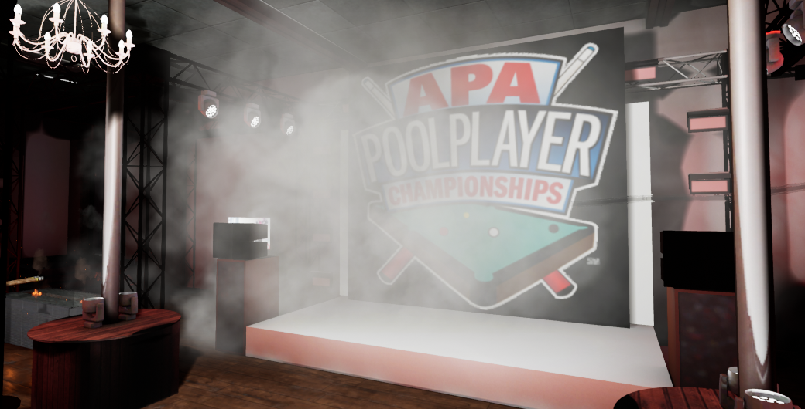
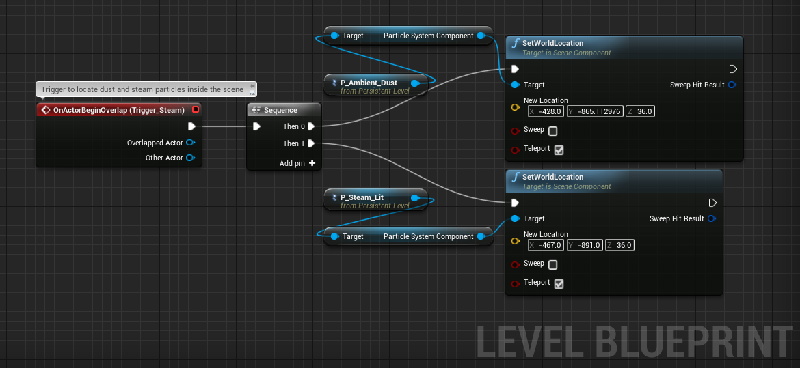

# Documentation
## Concept
Sequence of emblematic events that build an entertaining parade that sponsors a famous club in Moscow. The club has two main stages, contemporary and youth music; Pool tables, drinks, entertainment and more.
## Summary of sequence
The event begins when the guest presses a striking button in the center of the club, which will automatically spawn a heavy ball on the first pool table, which hits a domino sequence.

  

The sequence of dominos pushes a first billiard ball that will passes through half of the establishment above the back stage.

  

At the end of the course of the first billiard balls, the last one will fall on the second pool table, on which there is a pile of different balls that will push a final sequence of dominos and will end up sinking in the corners of the table.

  

With the fall of the last domino, a wave of smoke will fill the main stage while a last ball of steel runs through the installations. At the end of the last ball journey, the smoke will dissipate and the club logo will appear on the stage.

  

## Actors & Triggers
### Button

The button actor has a trigger box that collides with any other actor when overlapping, as the hand of the user is the only one capable of reaching it, it doesn't have any tag constraints. 
When the button is triggered, the actor __Ball__ spawns to begin the physics sequence. 

  

### Ball 

The Ball is a BP Pickup actor; movable, simulates physics with simple collision. Interacts with dominos and it can be grabbed by the player.  

### Domino

BP Actor with collision, physics and sound. Each time another component with "ball" or "domino" tag ovelap its own **box collider** a sound of hit is played 

  

### Pool Ball

BP Actor with collision, physics and sound. Each time another component with "ball" tag ovelap its own collider a sound of hit is played. When it pass through some box triggers some force is added

  

### Steel Ball

BP Actor with collision and physics. When it pass through some box triggers some force is added. This actor triggers some smoke on the scene then it pass through its boc trigger.

  

### Final Trigger

When any other actor passes through the smoke will dissapear and the brand logo will appear in stage.

  

